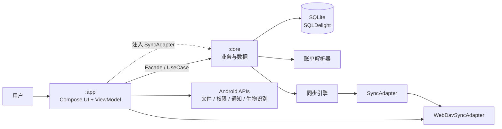
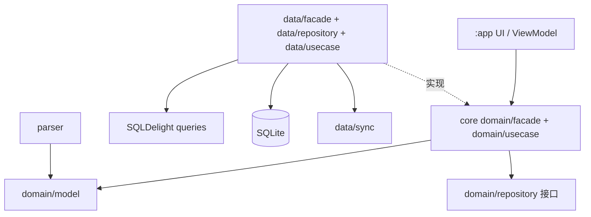
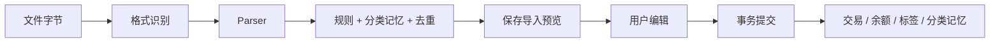

# OmniFlow 架构

## 模块边界

| 模块 | 职责 | 禁止事项 |
|---|---|---|
| `:app` | Compose UI、ViewModel、导航、文件选择、权限、通知、定时提醒、生物识别、WebDAV adapter | 不实现业务规则 |
| `:core` | 领域模型、Facade/UseCase、Repository、SQLDelight、账单解析、导入、统计、规则、去重、备份和同步引擎 | 不依赖 `:app` 或 Compose |

依赖方向只有 `:app -> :core`。同一业务规则只能在 `core` 实现一次。

## 运行结构



入口和组装位置：

- `app/src/main/kotlin/com/omniflow/android/OmniFlowApplication.kt` 创建 `SharedApp`，并注入 WebDAV adapter。
- `app/src/main/kotlin/com/omniflow/android/MainActivity.kt` 创建 ViewModel 并启动 Compose UI。
- `core/src/main/kotlin/com/omniflow/core/SharedApp.kt` 组装数据库、Repository、Facade、Workflow 和 UseCase。
- `core/src/main/kotlin/com/omniflow/core/AndroidSharedAppFactory.kt` 使用 `AndroidSqliteDriver` 打开 `omniflow.db`。

## Core 分层



约束：

- UI 只调用 `SharedApp` 暴露的 Facade、Workflow 和 UseCase，不直接访问 Repository 或 SQLDelight Query。
- `domain` 放模型、接口和业务用例；`data` 放 SQLDelight 实现和同步实现。
- 需要跨层传递的错误使用 `Result` 和 `AppError`；持续状态使用 `Flow`/`StateFlow`。
- 解析、导入、同步等耗时操作必须在后台线程执行。

## 数据规则

- SQLite 是本地唯一主数据源；schema 在 `core/src/main/sqldelight/com/omniflow/core/db/`，迁移文件为 `1.sqm` 至 `4.sqm`。
- 金额使用 `Long` 的分存储和计算，UI 才格式化为人民币文本；禁止使用浮点数表示金额。
- 业务实体使用字符串 UUID；需要删除但仍参与备份/恢复的数据使用软删除。
- 交易属于账本，账户是全局资源；账本范围必须由 core 查询和统计逻辑统一处理。
- 导入预览暂存于 `import_session` 和 `import_preview_item`，确认入账后由 core 在事务中写入交易并清理预览。

## 导入数据流



当前格式：

| 格式 | 实现 |
|---|---|
| 支付宝、京东、美团 CSV | `parser/csv` |
| 微信 XLSX、建设银行 XLS | `parser/spreadsheet`，Apache POI |
| 中国银行 PDF | `parser/pdf`，当前只识别 BOC 交易流水 |
| 青子记账 JSON | `parser/qingzi`，通过 `QingziInteropFacade` 导入/导出 |

格式枚举和识别入口是 `core/src/main/kotlin/com/omniflow/core/parser/ImportFormat.kt` 与 `BillFormatDetector.kt`。新增格式必须同时更新解析器、检测逻辑、导入测试和 UI 文件选择映射。

## 同步规则

- 同步是本地优先：先写 SQLite，再生成完整 JSON 备份记录。
- `core` 只依赖 `SyncAdapter` 接口；当前 Android 仅注入 WebDAV 实现。
- 同步支持列出、上传、下载、删除备份和覆盖恢复；恢复不合并本地数据。
- WebDAV 凭据存于 Android Keystore/SharedPreferences，不进入备份 payload。
- 修改同步数据结构时必须同时检查 `Backup.sq`、`SqlDelightBackupStore`、`SqlDelightSyncEngine` 和 Android adapter。

## Android UI

- UI 使用 Jetpack Compose 和 Material Design 3。
- Compose UI 状态、导航状态、Snackbar、权限结果和文件选择结果属于 `app`；业务状态由 core Facade/UseCase 提供。
- 一级导航当前为 Home、Analytics、Search、More；导航定义在 `app/src/main/kotlin/com/omniflow/android/ui/AppNavigation.kt`。
- 项目图标资源位于 `assets/icons/`，由 `CategoryIconCatalog`/`SvgIcon` 使用；不要在 core 复制 UI 图标逻辑。

## 验证

代码或 schema 变更后按影响范围验证：

```text
./gradlew :core:testDebugUnitTest
./gradlew :core:verifySqlDelightMigration
./gradlew :app:lintRelease
```

Android 发布流程还会构建 `arm64-v8a` release APK；只有发布相关修改才需要检查 `.github/workflows/release.yml`。
