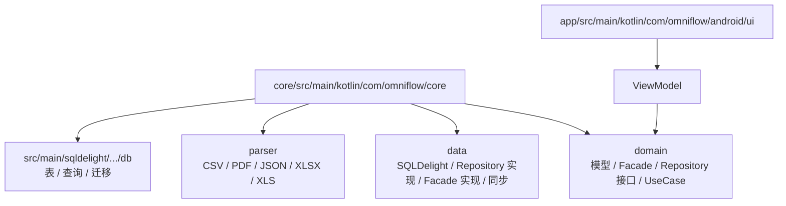
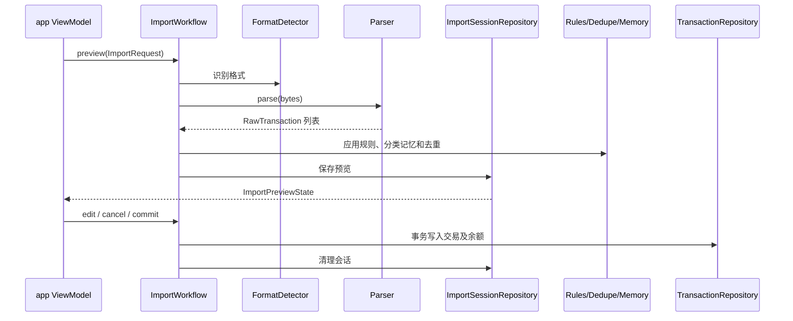

# OmniFlow 代码设计

本文档服务于 agent。实现细节以当前源码和 SQLDelight schema 为准；这里只保留定位入口、接口边界和修改规则。

## 代码入口

| 位置 | 作用 |
|---|---|
| `app/src/main/kotlin/com/omniflow/android/MainActivity.kt` | Android Activity、深链和 Compose 入口 |
| `app/src/main/kotlin/com/omniflow/android/OmniFlowApplication.kt` | 创建 `SharedApp`，注入 WebDAV |
| `app/src/main/kotlin/com/omniflow/android/ui/OmniFlowApp.kt` | Material 3 主题、顶层 UI、权限和生命周期集成 |
| `app/src/main/kotlin/com/omniflow/android/ui/OmniFlowViewModel.kt` | 收集 core 状态、维护 UI 状态、调用业务入口 |
| `app/src/main/kotlin/com/omniflow/android/ui/AppNavigation.kt` | `OmniRoute`、顶层导航和返回栈 |
| `core/src/main/kotlin/com/omniflow/core/SharedApp.kt` | 组装所有 core 依赖并暴露公共入口 |

## 目录职责



实际目录：

- `core/domain/model`：领域模型、查询条件、UI 可消费的业务状态和错误。
- `core/domain/facade`：Home、Management、Analytics、Budget、Reminder、AppPreference、Import、QingziInterop、Sync 接口。
- `core/domain/usecase`：账本、账户、分类、标签、规则、提醒和交易的写入/删除用例。
- `core/data/facade`：Facade/Workflow 的 SQLDelight 实现。
- `core/data/repository`：SQLDelight Repository 实现和导入会话/去重实现。
- `core/data/sync`：`SyncAdapter`、备份序列化和同步引擎。
- `core/parser`：格式识别与账单解析；解析结果统一为 `RawTransaction`。
- `core/src/main/sqldelight/com/omniflow/core/db`：`.sq` schema/query 和 `.sqm` migration。
- `app/src/main/kotlin/com/omniflow/android/ui`：当前 UI 文件直接位于此目录，没有按 screen 建子目录。

## Core 公共入口

`SharedApp` 当前暴露：

- `home`、`management`、`analytics`、`budgets`、`reminders`、`preferences`。
- `imports`、`qingzi`、`sync`、`search`。
- 账本、账户、分类、标签、规则、提醒和交易的 Create/Update/Delete/排序/校准 UseCase。
- `initialize` 和 `getTransactionRecordDetail(...)`。

新增业务能力时，优先在 `domain` 定义接口和模型，在 `data` 提供实现，再由 `SharedApp` 组装；不要让 ViewModel 直接创建 Repository。

## Facade / Workflow 约定

- 读模型优先返回 `Flow<Result<T>>`；同步状态使用 `StateFlow`。
- 一次性写操作返回 `Result<T>`，失败转换为 `AppError` 或保留可读错误。
- `ImportWorkflow` 的边界是：

```kotlin
fun preview(request: ImportRequest): Flow<Result<ImportPreviewState>>
fun observe(sessionId: ImportSessionId): Flow<Result<ImportPreviewState>>
suspend fun editItem(edit: ImportPreviewEdit): Result<ImportPreviewState>
suspend fun editCategories(sessionId: ImportSessionId, edit: ImportCategoryBatchEdit): Result<ImportPreviewState>
suspend fun editSkipped(sessionId: ImportSessionId, edit: ImportExcludeBatchEdit): Result<ImportPreviewState>
suspend fun cancel(sessionId: ImportSessionId): Result<Unit>
suspend fun commit(sessionId: ImportSessionId): Result<ImportCommitResult>
```

- `commit` 必须检查状态，在单个 SQLite 事务中写交易、账户余额、标签和分类记忆，并删除导入会话。
- `SyncFacade` 负责配置、观察状态、列出备份、立即同步和恢复；远端操作通过 `SyncAdapter`。

## 导入实现



格式实现：

| `ImportFormat` | 文件 | 入口 |
|---|---|---|
| `ALIPAY` / `JD` / `MEITUAN` | CSV | `parser/csv` |
| `WECHAT` | XLSX | `parser/spreadsheet/SpreadsheetBillParser.kt` |
| `CCB` | XLS | `parser/spreadsheet/SpreadsheetBillParser.kt` |
| `BOC` | PDF | `parser/pdf/BocPdfBillParser.kt` |
| `QINGZI` | JSON | `parser/qingzi/QingziBillParser.kt` |

文件扩展名优先识别 XLSX/XLS/PDF；CSV 和 JSON 还会检查文件内容。新增格式时更新 `ImportFormat`、`SqlDelightImportWorkflow.parse/detectFormat`、对应 parser 和 `core/src/test` 测试。

## 持久化与迁移

- 数据库名称为 `omniflow.db`，Android driver 在 `AndroidSharedAppFactory.kt` 创建。
- SQL 只能放在 `core/src/main/sqldelight/com/omniflow/core/db/*.sq`；业务代码通过生成的 Query 或 Repository 访问。
- 修改表结构必须添加递增 `.sqm` migration，不要直接改写历史 migration。
- 需要备份的新表必须同时加入 `Backup.sq` 的导出、清理和恢复查询，并检查 `SqlDelightBackupStore`。
- core 数据逻辑测试位于 `core/src/test`；当前没有 `app/src/test`。

## 同步实现

`SyncAdapter` 只有四个远端操作：`listBackups`、`uploadBackup`、`downloadBackup`、`deleteBackup`。当前实现是 `app/WebDavSyncAdapter.kt`，使用 HTTPS WebDAV；core 通过 `SharedApp` 接收 adapter map。

备份是完整 JSON 快照，包含业务表和可恢复的应用偏好；恢复会清空并覆盖当前可恢复数据，不做合并。WebDAV 凭据不进入备份 payload。

## UI 规则

- UI 遵循 Material Design 3，组件和主题集中在 `OmniFlowApp.kt`、`OmniTokens.kt` 等 app 文件中。
- ViewModel 负责组合 core 状态和 UI-only 状态；业务计算不得复制到 Composable。
- 图标优先使用现有 `assets/icons` SVG 与 `SvgIcon`；分类 `icon_key` 必须与资源文件名一致。
- 新增导航先更新 `AppNavigation.kt` 的 `OmniRoute` 和返回栈，再接入 `OmniFlowApp.kt`。
- 文件选择、通知、提醒调度、生物识别和 Android 生命周期逻辑只能放在 `app`。

## 依赖与验证

- `core` 依赖 SQLDelight、kotlinx serialization、kotlinx datetime、coroutines 和 Apache POI OOXML。
- `app` 依赖 Compose Material 3、Navigation 3、Biometric 和 Fragment；业务依赖通过 `:core` 提供。
- Release 当前在 `app/build.gradle.kts` 未显式开启 R8/resource shrink；涉及 APK 体积时只改构建配置，不要在业务代码中重复实现裁剪。
- 修改后按影响范围运行：

```text
./gradlew :core:testDebugUnitTest
./gradlew :core:verifySqlDelightMigration
./gradlew :app:lintRelease
```

不要为了 UI 修改运行 core 业务；不要为了 core 修改顺手重构 app。跨模块变更必须检查 `SharedApp` 的组装和所有 app 调用点。
